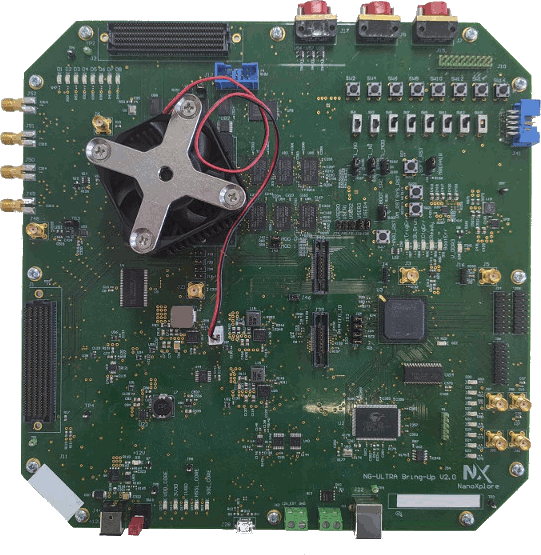

.. _ngultra_bring_up:

NanoXplore NG-Ultra Bring-up
############################

Overview
********

The NG-Ultra bring-up is a demonstrator board showing NG-Ultra capabilities.
The NG-Ultra is a radiation hardened by design SoC for aerospace applications.

Hardware
********

- 4 ARM Cortex-R52
- hardened FPGA fabric (540k LUT)
- 6 status LEDs
- 256 MiB of flash memory
- 256 MiB of DDR2 memory with redundancy
- SpaceWire bus

Supported Features
==================

+-----------+------------+----------------------+
| Interface | Controller | Driver/Component     |
+===========+============+======================+
| GIC-v3    | on-chip    | interrupt controller |
+-----------+------------+----------------------+
| UART      | on-chip    | serial               |
+-----------+------------+----------------------+

Other hardware features are not currently supported by Zephyr.

Connections and IOs
===================

J28 Mictor-38 connector

+-------+--------------+
| PIN # | Signal Name  |
+=======+==============+
| 3     | TRST         |
+-------+--------------+
| 5     | TDI          |
+-------+--------------+
| 7     | TMS          |
+-------+--------------+
| 9     | TCK          |
+-------+--------------+
| 13    | TDO          |
+-------+--------------+
| 15    | SRST         |
+-------+--------------+
| 20    | GND          |
+-------+--------------+

Programming and Debugging
*************************

Flashing
========

The board is delivered with an SDK which provides scripts to flash the
device.

Debugging
=========

- Debugging via JTAG is possible with the J28 connector
- Debugging via your favorite terminal program to listen for output with the J39
  connector.

   .. code-block:: console

      $ screen /dev/ttyUSB1 115200
